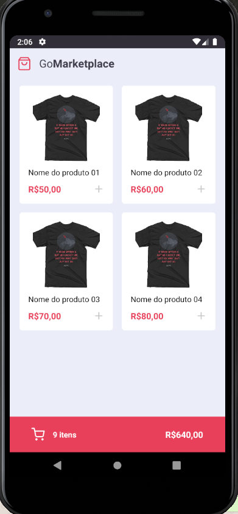
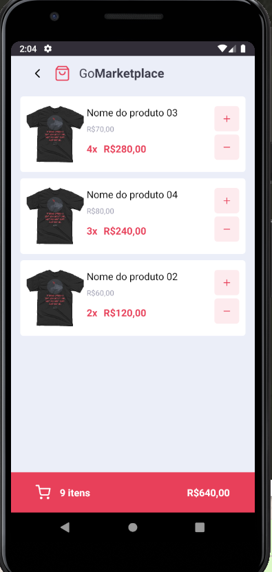
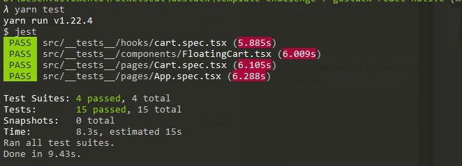

<p align="center">
  <a href="#rocket-tecnologias">Tecnologias</a>&nbsp;&nbsp;&nbsp;|&nbsp;&nbsp;&nbsp;
  <a href="#-projeto">Projeto</a>&nbsp;&nbsp;&nbsp;|&nbsp;&nbsp;&nbsp;
  <a href="#-como-rodar">Como rodar</a>&nbsp;&nbsp;&nbsp;|&nbsp;&nbsp;&nbsp;
  <a href="#-como-contribuir">Como contribuir</a>&nbsp;&nbsp;&nbsp;
  </p>

<br>

<p align="center">
  
</p>

<p width="450" height="800" align="center">
  
</p>

## GoStack - Setimo desafio React

## 🚀 Tecnologias

Esse projeto foi desenvolvido com as seguintes tecnologias:

- [React Native](https://reactnative.dev/) - 0.63.3
- [Yarn](https://yarnpkg.com/) - 1.22.4
- [Npm](https://www.npmjs.com/) - 6.14.5


## 💻 Projeto

Projeto em React Native para consumir uma API fake de produtos.
Descrição do desafio [GoStack](https://github.com/rocketseat-education/bootcamp-gostack-desafios/tree/master/desafio-fundamentos-react-native)


Resolulção do teste.
<p align="center">
  
</p>

## 🚀 Como Rodar

- Clone o projeto.
- Entre na pasta do projeto e rode yarn install (pode usar npm install de acordo com a sua configuração).
- yarn test para rodar os testes.
- para rodar a API fake use o comando:
```
yarn json-server server.json -p 3333
```

- Caso tenha problema com a conexão tente:
```
adb reverse tcp:3333 tcp:3333
```

Para rodar o emulador do Android ou iOS siga o guia da [Rocketseat](https://react-native.rocketseat.dev/).

## 🤔 Como contribuir

- Faça um fork desse repositório;
- Cria uma branch com a sua feature: `git checkout -b minha-feature`;
- Faça commit das suas alterações: `git commit -m 'feat: Minha nova feature'`;
- Faça push para a sua branch: `git push origin minha-feature`.

Depois que o merge da sua pull request for feito, você pode deletar a sua branch.

## 📝 Licença

Esse projeto está sob a licença MIT.
